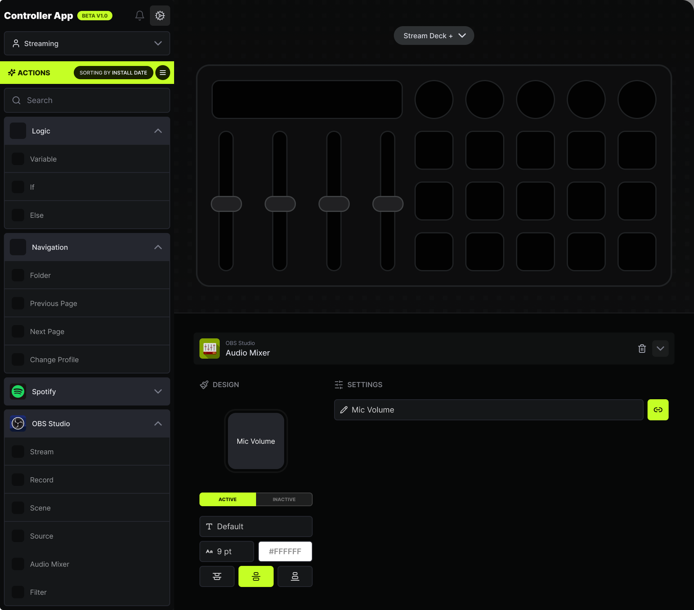

# KaDeck

KaDeck is a StreamDeck App that will allow you to configure your StreamDeck with a lot of different modules and actions.



## This is a work in progress!!

We're still designing how things will work, but the idea is to have a Tauri App that will communicate with a Rust Worker
that will be listening to the StreamDeck events.

Our goal is to make something compatible and easy to use for everyone, so we're trying to make it as modular as possible.

## How to run

This is a Tauri App, so you will need to have Tauri and Rust (stable) installed in your machine.
````bash
pnpm tauri dev
````

## Contributing

We're still designing how things will work, so if you have any ideas, feel free to open an issue or a PR.